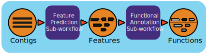

Metagenome Annotation Workflow (v1.1.4)
=======================================

Workflow Overview
-----------------
This workflow takes assembled metagenomes and generates structural and functional annotations. It is based on the `JGI/IMG annotation pipeline <https://code.jgi.doe.gov/img/img-pipelines/img-annotation-pipeline/>`_ (`more details <https://journals.asm.org/doi/10.1128/msystems.00804-20>`_) and uses a number of open-source tools and databases to generate the structural and functional annotations. 

The input assembly is first split into 10MB splits to be processed in parallel. Depending on the workflow engine configuration, the split can be processed in parallel. Each split is first structurally annotated, then those results are used for the functional annotation. The structural annotation uses :code:`tRNAscan_se`, :code:`RFAM`, :code:`CRT`, :code:`Prodigal` and :code:`GeneMarkS`. These results are merged to create a consensus structural annotation. The resulting GFF is the input for functional annotation which uses multiple protein family databases (:code:`SMART`, :code:`COG`, :code:`TIGRFAM`, :code:`SUPERFAMILY`, :code:`Pfam` and :code:`Cath-FunFam`) along with custom :code:`HMM` models. The functional predictions are created using :code:`Last` and :code:`HMM`. These annotations are also merged into a consensus GFF file. Finally, the respective split annotations are merged together to generate a single structural annotation file and single functional annotation file. In addition, several summary files are generated in TSV format.

Workflow Availability
---------------------
The workflow is available in GitHub: https://github.com/microbiomedata/mg_annotation/ and the corresponding Docker image is available in DockerHub: 

- `microbiomedata/img-omics:5.2.0 <https://hub.docker.com/r/microbiomedata/img-omics>`_

Requirements for Execution (recommendations are in bold):  
---------------------------------------------------------

- WDL-capable Workflow Execution Tool *(Cromwell)*
- Container Runtime that can load Docker images *(Docker v2.1.0.3 or higher)*

Hardware Requirements: 
----------------------
- Disk space: 106 GB for the reference databases
- Memory: >100 GB RAM

Workflow Dependencies
---------------------

- Third party software (This is included in the Docker image.)  

  - Conda (3-clause BSD)
  - tRNAscan-SE >= 2.0.12 (GNU GPL v3)
  - Infernal 1.1.3 (BSD)
  - CRT-CLI 1.8.4 (Public domain software, last official version is 1.2)
  - Prodigal 2.6.3_patched (GNU GPL v3)
  - GeneMarkS-2 >= 1.25 (`Academic license for GeneMark family software <http://topaz.gatech.edu/GeneMark/license_download.cgi>`_)
  - Last >= 1456 (GNU GPL v3)
  - HMMER 3.1b2 (3-clause BSD, `thread optimized <https://github.com/Larofeticus/hpc_hmmsearch>`_)
  - GeNomad 1.8.1 (GNU GPL v3, pulled from `IMG Annotation Pipeline repo <https://code.jgi.doe.gov/img/img-pipelines/img-annotation-pipeline>`_)

- Requisite databases: 

  - Rfam 13.0 (public domain/CC0 1.0; `more info <http://reusabledata.org/rfam>`_)
  - KEGG (paid subscription, getting KOs/ECs indirectly via IMG-NR 20230629; `more info <http://reusabledata.org/kegg-ftp>`_)
  - SMART 01_06_2016 (restrictive license/custom; `more info <http://reusabledata.org/smart>`_)
  - COG 2003 (copyright/unlicensed; `more info <http://reusabledata.org/cogs>`_)
  - TIGRFAM v15.0 (copyleft/LGPL 2.0 or later; `more info <http://reusabledata.org/tigrfams>`_)
  - SUPERFAMILY v1.75 (permissive/custom; `more info <http://reusabledata.org/supfam>`_) 
  - Pfam v34.0 (public domain/ CC0 1.0; `more info <http://reusabledata.org/pfam>`_) 
  - Cath-FunFam v4.2.0 (permissive/CC BY 4.0; `more info <http://reusabledata.org/cath>`_) 
  - GeNomad v1.7 (permissive/CC BY 4.0; `more info <https://zenodo.org/records/10594875>`_) 

Sample datasets
---------------
- Processed Metatranscriptome of soil microbial communities from the East River watershed near Crested Butte, Colorado, United States - ER_RNA_119 (`SRR11678315 <https://www.ncbi.nlm.nih.gov/sra/SRX8239222>`_) with `metadata available in the NMDC Data Portal <https://data.microbiomedata.org/details/study/nmdc:sty-11-dcqce727>`_. 

  - The zipped raw fastq file is available `here <https://portal.nersc.gov/project/m3408//test_data/metaT/SRR11678315.fastq.gz>`_
  - The zipped, qc'ed fastq file is available `here <https://portal.nersc.gov/cfs/m3408/test_data/metaT/SRR11678315/readsqc_output/SRR11678315-int-0.1_filtered.fastq.gz>`_
  - The assembled fasta file is available `here <https://portal.nersc.gov/cfs/m3408/test_data/metaT/SRR11678315/assembly_output/SRR11678315-int-0.1_contigs.fna>`_
  - the sample annotation outputs are available `here <https://portal.nersc.gov/cfs/m3408/test_data/metaT/SRR11678315/annotation_output/>`_

Inputs
------
A JSON file containing the following: 

#. The path to the assembled contigs fasta file 
#. output file prefix
#.	(optional) parameters for memory 
#.	(optional) number of threads requested

An example JSON file is shown below:

.. code-block:: JSON

      {
      "annotation.input_file": "https://portal.nersc.gov/cfs/m3408/test_data/metaT/SRR11678315/assembly_output/SRR11678315-int-0.1_contigs.fna",
      "annotation.proj": "SRR11678315-int-0.1",
      "annotation.imgap_project_id": "SRR11678315-int-0.1"
      }

Output
------
The final structural and functional annotation files are in GFF format and the summary files are in TSV format.  The key outputs are *italicized* below but additional files are available.

.. list-table:: 
   :header-rows: 1

   * - Directory/File Name
     - Description
   * - prefix_cath_funfam.gff
     - gff functional annotation generated from Cath-FunFam (Functional Families) database
   * - prefix_cog.gff
     - gff functional annotation generated from COG (Clusters of Orthologous Groups) database
   * - prefix_contig_names_mapping.tsv
     - tsv mapping assembly scaffold IDs to contig annotation IDs (to be uniform)
   * - prefix_contigs.fna
     - fasta with contigs renamed to annotation IDs
   * - prefix_crt.crisprs
     - xml file with CRISPR terms
   * - prefix_crt.gff
     - gff structural annotation generated with CRT
   * - *prefix_ec.tsv*
     - *tsv file for EC annotation*
   * - *prefix_functional_annotation.gff*
     - *gff with functional annotations*
   * - prefix_genemark.gff
     - gff with structural annotation by GeneMark
   * - *prefix_gene_phylogeny.tsv*
     - *tsv of gene phylogeny*
   * - prefix_imgap.info
     - workflow information
   * - *prefix_ko_ec.gff*
     - *gff annotation with KO and EC terms*
   * - prefix_ko.tsv
     - tsv of only KO terms
   * - prefix_pfam.gff
     - gff functional annotation from Pfam database
   * - prefix_prodigal.gff
     - gff structural annotation by Prodigal
   * - prefix_product_names.tsv
     - tsv of annotation products
   * - prefix_proteins.faa
     - fasta of protein sequences
   * - prefix_rfam.gff
     - gff structural annotation by RFAM
   * - prefix_scaffold_lineage.tsv
     - tsv of phylogeny at scaffold level
   * - prefix_smart.gff
     - gff functional annotation from SMART database
   * - prefix_stats.json
     - json of annotation statistics report
   * - prefix_stats.tsv
     - tsv of annotation statistics report
   * - *prefix_structural_annotation.gff*
     - *gff structural annotation*
   * - prefix_supfam.gff
     - gff functional annotation from SUPERFAMILY database
   * - prefix_tigrfam.gff
     - gff functional annotation from TIGRFAM database
   * - prefix_trna.gff
     - gff structural annotation by tRNAscan-SE

Version History
---------------
- 1.1.4 (08/09/2024)
- 1.0.0 (release data)

Point of contact
----------------

- Author: Shane Canon <scanon@lbl.gov>
- Maintainer: Kaitlyn Li <kli@lanl.gov>

