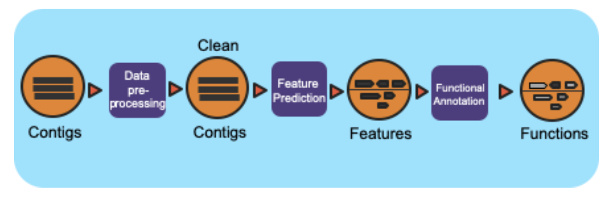

Metagenome Annotation Workflow
==============================

Summary
-------

This workflow is based on the JGI/IMG metagenome annotation pipeline.
It takes assembled metagenomes and generates structrual and functional annotations.  The workflow splits the input assembly
into 10MB shards and proccesses those in parallel.  The workflow uses a number of open-source tools and databases to generate the structural
and functional annotations.

Workflow Diagram
------------------

Workflow Dependencies
---------------------

Third party software
~~~~~~~~~~~~~~~~~~~~

- Conda (3-clause BSD)
- tRNAscan-SE >= 2.0 (GNU GPL v3)
- Infernal 1.1.2 (BSD)
- CRT-CLI 1.8 (Public domain software, last official version is 1.2)
- Prodigal 2.6.3 (GNU GPL v3)
- GeneMarkS-2 >= 1.07 (Academic license for GeneMark family software)
- Last >= 983 (GNU GPL v3)
- HMMER 3.1b2 (3-clause BSD)
- TMHMM 2.0 (Academic)

Database 
~~~~~~~~~~~~~~~~
- Rfam (Creative Commons Zero ("CC0"))
- SMART (Academic)
- COG (Free, No license available, HMMs created from the 2003 models)
- TIGRFAM (Free, No license available)
- SUPERFAMILY (Academic)
- Pfam (GNU Lesser General Public License)
- Cath-FunFam (Free, No license available)

Workflow Availability
---------------------

The workflow is available in GitHub:
https://github.com/microbiomedata/mg_annotation/

The container is available at Docker Hub (microbiomedata/mg-annotation):
https://hub.docker.com/r/microbiomedata/mg-annotation

The databases are available by request.
Please contact NMDC (support@microbiomedata.org) for access.

Test datasets
-------------
https://raw.githubusercontent.com/microbiomedata/mg_annotation/master/example.fasta

Details
---------------------
The annotation workflow is based on the IMG annotation workflow.  The input assembly
is first split into 10MB chunks.  Depending on the workflow engine configuration,
the in splits can be processed in parallel.  Each split is first structurally annotated,
then then those results are used for the functional annotation.  The structural annotation
uses tRNAscan_se, RFAM, CRT, Prodigal and GeneMarkS.  These results are merged to create
a concensus structural annotation.  The resulting GFF is used in the functional annootation
which uses multiple protein family databases (SMART, COG, TIGRFAM, SUPERFAMILY, Pfam and 
Cath-FunFam) along with custom HMM models to generate the functional annotations.  These 
predictions are done using Last and HMM.  These annotations are merged into a consensus 
GFF file.  Finally, the split annotations are merged together to generate a single structural
anotation file and single functional annotation file.  In addition, several summary files
are generated in TSV format.

Inputs
~~~~~~~~

- Fasta Assembly (generated using the metagenome assembly workflow)

Outputs
~~~~~~~~

- GFF: Structural annotation
- GFF: Functional annotation
- TSV: KO Summary
- TSV: EC Summary
- TSV: Gene Phylogeny Summar

Requirements for Execution
--------------------------

- Docker or other Container Runtime
- Cromwell or other WDL-capable Workflow Execution Tool

Running Workflow in Cromwell on Cori
------------------------------------

TBD

Version History
---------------

- 1.0.0

Point of contact
----------------

Package maintainer: Shane Canon <scanon@lbl.gov>

